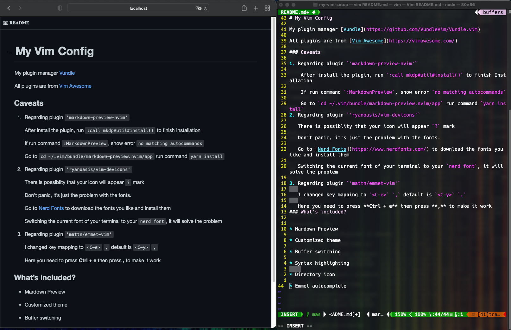
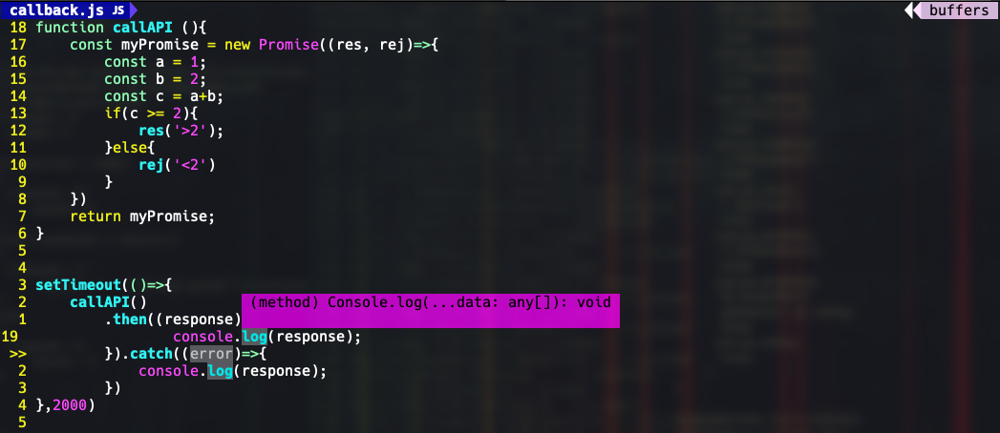
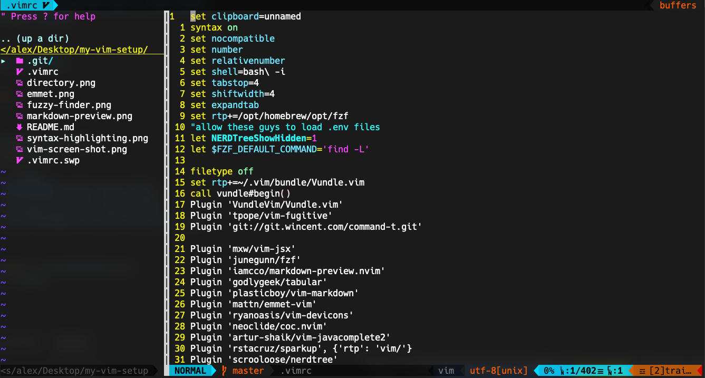
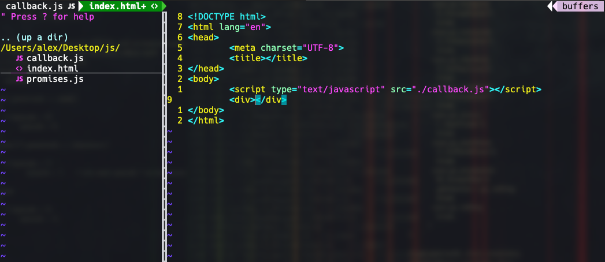

# My Vim Config

My plugin manager [Vundle](https://github.com/VundleVim/Vundle.vim) 

All plugins are from [Vim Awesome](https://vimawesome.com/)

### Caveats

1. Regarding plugin `'markdown-preview-nvim'`

    After install the plugin, run `:call mkdp#util#install()` to finish Installation

    If run command `:MarkdownPreview`, show error `no matching autocommands`

    Go to `cd ~/.vim/bundle/markdown-preview.nvim/app` run command `yarn install`
2. Regarding plugin `'ryanoasis/vim-devicons'`

   There is possiblity that your icon will appear `?` mark

   Don't panic, it's just the problem with the fonts.

   Go to [Nerd Fonts](https://www.nerdfonts.com/) to download the fonts you like and install them

   Switching the current font of your terminal to your `nerd font`, it will solve the problem

3. Regarding plugin `'mattn/emmet-vim'`
   
   I changed key mapping to `<C-e>` `,` default is `<C-y>` `,`
   
   Here you need to press **Ctrl + e** then press **,** to make it work
### What's included?

* Markdown Preview
    
    
    `:MarkdownPreview` `:MarkdownPreviewStop`
* Customized theme

    My theme setting `let g:airline_theme='tomorrow'`
    
    You can check out more here [vim-airline](https://github.com/vim-airline/vim-airline/wiki/Screenshots)

* Buffer switching
    
    `gn`(next buffer),`gb`(back buffer),`gd`(delete buffer)

* Syntax highlighting
    
    

* Directory icon 

    
    `Ctrl + t` to toggle nerdtree
    
    `Ctrl + n` to swtich between current file and nerdtre
    
   `o` to open the file in nerdtree
* Emmet autocomplete

    
    `Ctrl + e` `,` to trigger emmet

