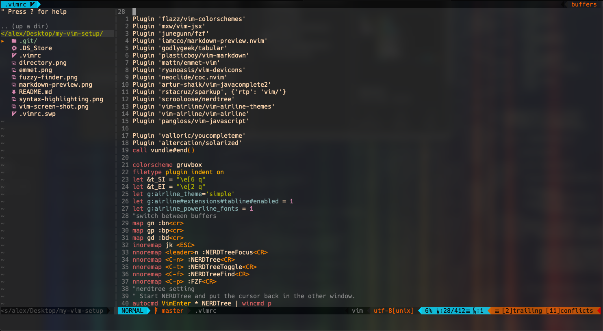
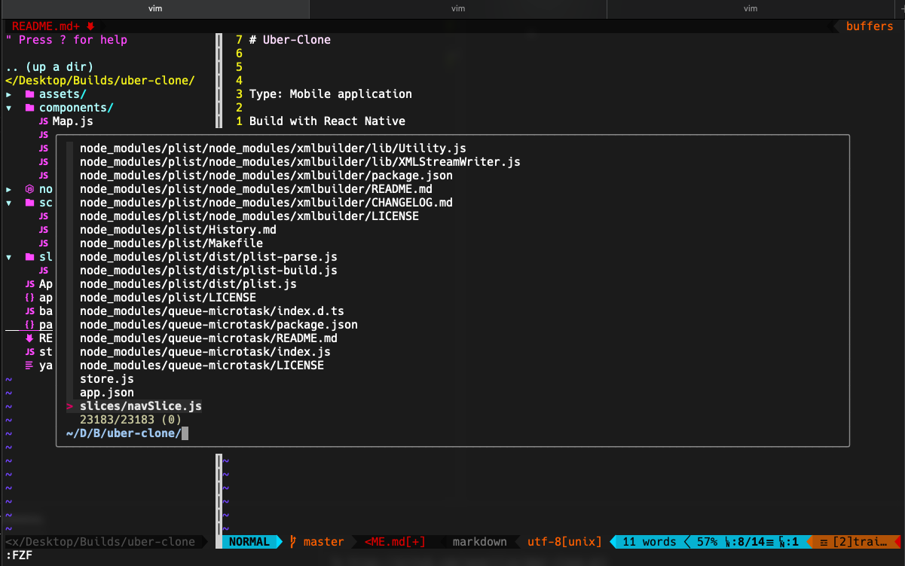
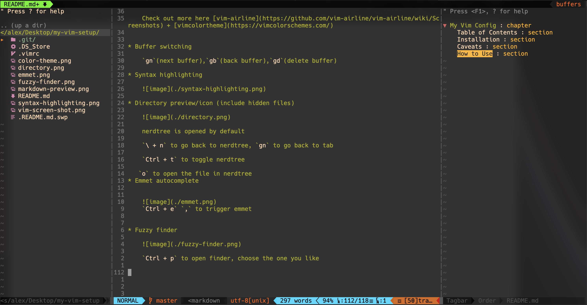

# My Vim Config

My plugin manager [Vundle](https://github.com/VundleVim/Vundle.vim) 

All plugins are from [Vim Awesome](https://vimawesome.com/)

## Table of Contents

* [Installation](#installation)
* [Caveats](#caveats)
* [How to Use](#how-to-use)

## Installation

Copy everything inside `.vimrc` file, and paste them into your `.vimrc` file

Then run `:PluginInstall`

## Caveats

1. Regarding plugin `'markdown-preview-nvim'`

    After install the plugin, run `:call mkdp#util#install()` to finish Installation

    If run command `:MarkdownPreview`, show error `no matching autocommands`

    Go to `cd ~/.vim/bundle/markdown-preview.nvim/app` run command `yarn install`
   
2. Regarding plugin `'ryanoasis/vim-devicons'`

   There is possiblity that your icon will appear `?` mark

   Don't panic, it's just the problem with the fonts.

   Go to [Nerd Fonts](https://www.nerdfonts.com/) to download the fonts you like and install them

   Switching the current font of your terminal to your `nerd font`, it will solve the problem

3. Regarding plugin `'junegunn/fzf'`

   You need to install fzf (fuzzy finder) first, see [fzf](https://github.com/junegunn/fzf) installation instructions. I used `brew install fzf`

## How to Use

* Prettifier

    `sudo npm i -g prettier` or `yarn global add prettier`
    
    To execute prettier `:Prettier`
    
* Auto-paring (, {, [, etc

* Markdown Preview
    
    
    `mp` `mps`
* Customized theme(vim + tabline)

    

    Tabline theme setting `let g:airline_theme='simple'`

    Vim theme setting `colorscheme gruvbox`
    
    Check out more here [vim-airline](https://github.com/vim-airline/vim-airline/wiki/Screenshots) + [vimcolortheme](https://vimcolorschemes.com/)

* Buffer switching
    
    `gm`(next buffer),`gn`(previous buffer),`gd`(delete buffer)

* Syntax highlighting
    
    

* Directory preview/icon (include hidden files)

    
     
    nerdtree is opened by default

    `nn` to go back to nerdtree, `gn` to go back to tab

    `tt` to toggle nerdtree
    
   `o` to open the file in nerdtree
* Emmet autocomplete

    
    `,,` to trigger emmet

* Fuzzy finder

    

    `ff` to open finder, choose the one you like 

* Tagbar

    

    `F8` open tagbar, `tn` switch to tagbar

